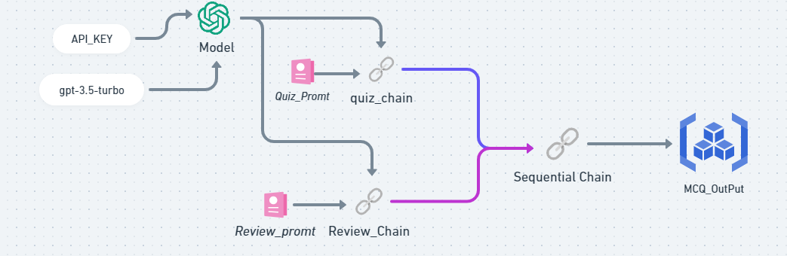

# AI-Enhanced MCQ Generation and Evaluation System


### Architecture
```
└── MCQ Generation and Evaluation System
    ├── Read Text from File
    └── LangChain
        ├── MCQ Generation Template
        │   └── GPT-3.5 Turbo Model
        │       └── MCQ Generation Chain
        └── MCQ Evaluation Template
            └── GPT-3.5 Turbo Model
                └── MCQ Evaluation Chain

```




## Library Dependencies:

1. **LangChain:**
   - **Description:** LangChain is a language model interaction framework that facilitates communication with the GPT-3.5 Turbo model.
   - **Usage:** The MCQ Generation and Evaluation System leverage LangChain for managing interactions with the language model, including prompt generation and responses.

2. **OpenAI's GPT-3.5 Turbo Model:**
   - **Description:** OpenAI's GPT-3.5 Turbo is a powerful language model capable of generating human-like text.
   - **Usage:** Both the MCQ Generation and Evaluation Chains utilize the GPT-3.5 Turbo model for generating MCQs and evaluating their complexity.

3. **PyPDF2:**
   - **Description:** PyPDF2 is a library for reading and manipulating PDF files.
   - **Usage:** The system does not directly depend on PyPDF2 in the provided code. If future enhancements include PDF processing, this library may be used.

## Component Dependencies:

1. **Read Text from File:**
   - **Dependencies:** None
   - **Usage:** Reads input text from a file to serve as the basis for generating MCQs.

2. **MCQ Generation Template:**
   - **Dependencies:** None
   - **Usage:** Creates a template for generating prompts for MCQs. No external dependencies are required for template creation.

3. **MCQ Generation Chain:**
   - **Dependencies:**
      - LangChain
      - GPT-3.5 Turbo Model
   - **Usage:** Utilizes LangChain for prompt-based communication with the GPT-3.5 Turbo model to generate MCQs.

4. **MCQ Evaluation Template:**
   - **Dependencies:** None
   - **Usage:** Creates a template for evaluating the complexity of the generated MCQs.

5. **MCQ Evaluation Chain:**
   - **Dependencies:**
      - LangChain
      - GPT-3.5 Turbo Model
   - **Usage:** Utilizes LangChain for prompt-based communication with the GPT-3.5 Turbo model to evaluate the complexity of the generated MCQs.

6. **Generate & Evaluate Chain:**
   - **Dependencies:**
      - MCQ Generation Chain
      - MCQ Evaluation Chain
   - **Usage:** Combines both the MCQ Generation and Evaluation Chains in a sequential manner for a comprehensive generation and evaluation process.

7. **Print Quiz:**
   - **Dependencies:** None
   - **Usage:** Prints the generated quiz for reference.

8. **Parse Quiz Data:**
   - **Dependencies:** None
   - **Usage:** Parses the generated quiz into a structured format for easier analysis.

## Summary:

The MCQ Generation and Evaluation System primarily depend on LangChain for interaction with the GPT-3.5 Turbo model, which is the core engine for both generating MCQs and evaluating their complexity. The additional dependencies, such as PyPDF2, may be introduced based on specific requirements for future enhancements. Understanding these dependencies is crucial for maintaining and extending the functionality of the system.


